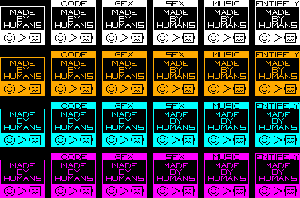

# retro-made-by-humans-badges
Some free-as-in-speech badges to use in your games, retro or otherwise

## Why?
Because there is an increasing amount of AI generated code, graphics and sound/music appearing in gamedev, even in retro gaming, and because lots of people care about whether or not a game contains AI elements or not.

## How?
This repo contains a single image with several variations of a badge design, with the intention of declaring exactly which elements of a game are made by humans, as opposed to AI.

You are free to use and adapt these designs however you like. This repo and everything in it is licensed under MIT.

I only ask that you don't use them to misrepresent your work as being free from AI if it really isn't, but I'm not sure why anyone would do that in the first place.

## The images

